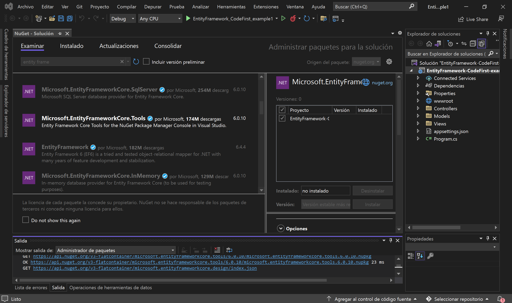
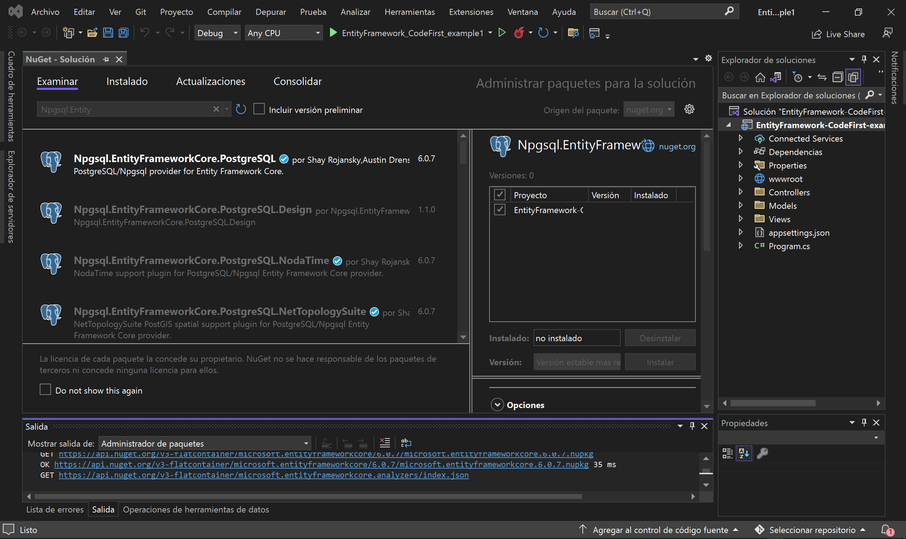
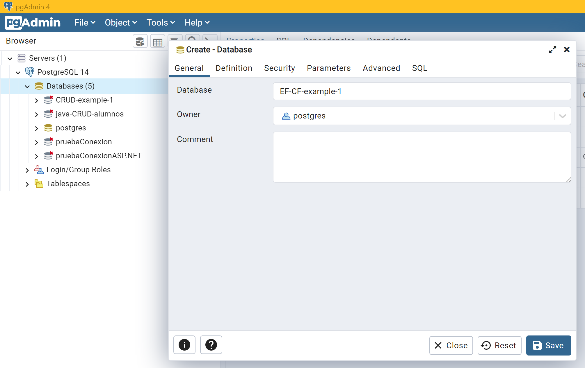
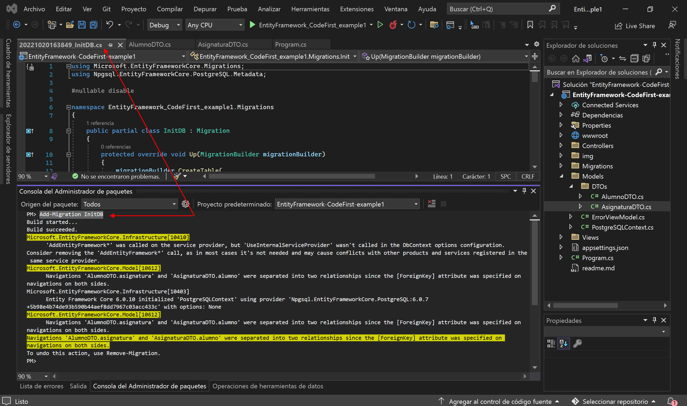
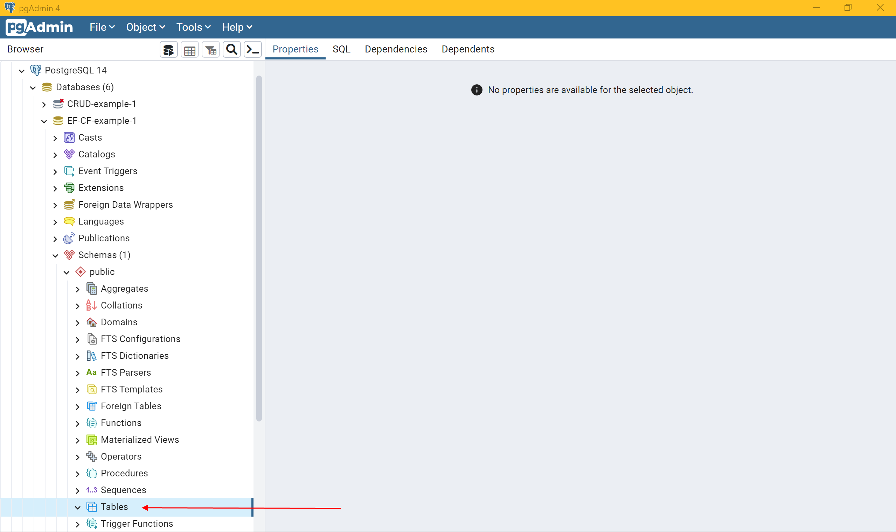
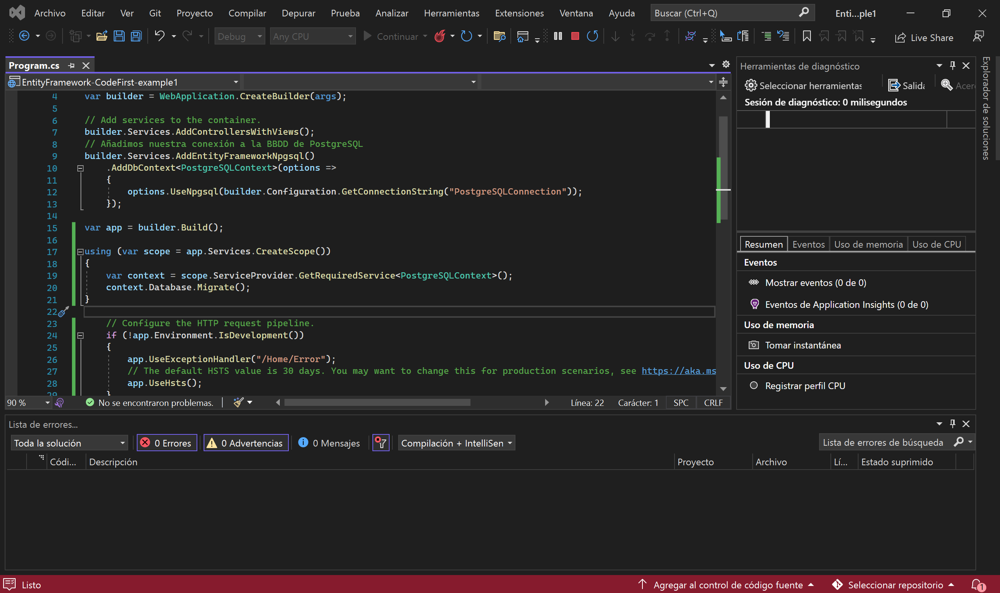
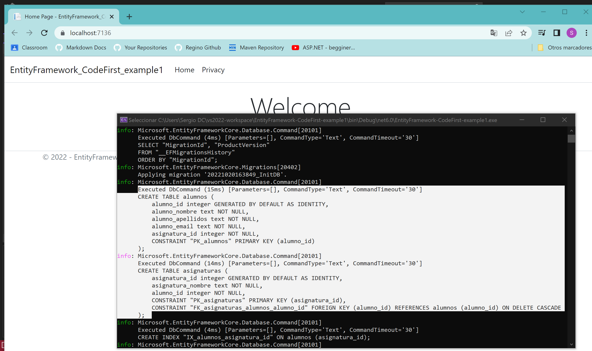
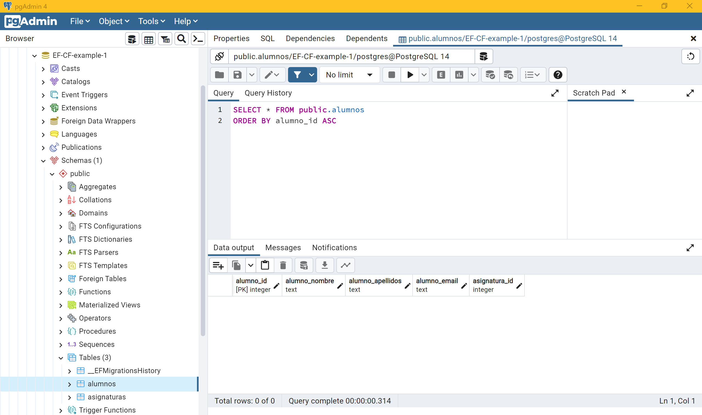
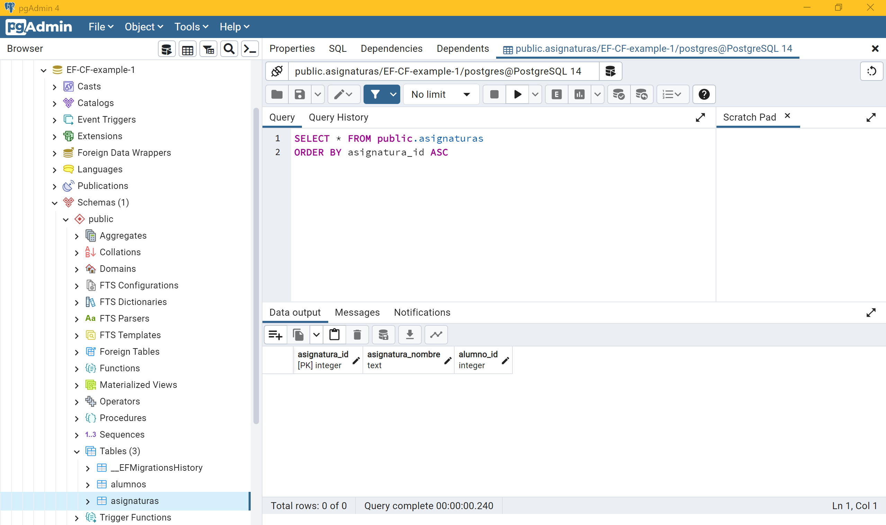

# Entity Framework - Code First - MVC - example 1

# 0. Crear el proyecto e instalar los NuGets

Creamos un proyecto de tipo MVC e instalamos los siguientes paquetes:





# 1. Los modelos (DTOs)

## 1.1. AlumnoDTO

```csharp
using System.ComponentModel.DataAnnotations;
using System.ComponentModel.DataAnnotations.Schema;

namespace EntityFramework_CodeFirst_example1.Models.DTOs
{
    public class AlumnoDTO
    {
        [Key]
        [DatabaseGenerated(DatabaseGeneratedOption.Identity)] // el autoincrementable
        public int alumno_id { get; set; }
        public string alumno_nombre { get; set; }
        public string alumno_apellidos { get; set; }
        public string alumno_email { get; set; }

        public int asignatura_id { get; set; }
        [ForeignKey("asignatura_id")]
        public virtual AsignaturaDTO asignatura { get; set; }
    }
}
```

## 1.2. AsignaturaDTO

```csharp
using System.ComponentModel.DataAnnotations;
using System.ComponentModel.DataAnnotations.Schema;

namespace EntityFramework_CodeFirst_example1.Models.DTOs
{
    public class AsignaturaDTO
    {
        [Key]
        [DatabaseGenerated(DatabaseGeneratedOption.Identity)]
        public int asignatura_id { get; set; }
        public string asignatura_nombre { get; set; }
        

        public int alumno_id { get; set; }
        [ForeignKey("alumno_id")]
        public virtual AlumnoDTO alumno { get; set; }
    }
}
```

**Nota**: No crees la propiedad del id del otro modelo, realmente no necesitamos ese campo.

# 2. El Context

Creamos una clase llamada *PostgreSQLContext.cs*:

```csharp
using EntityFramework_CodeFirst_example1.Models.DTOs;
using Microsoft.EntityFrameworkCore;

namespace EntityFramework_CodeFirst_example1.Models
{
    public class PostgreSQLContext : DbContext
    {
        public PostgreSQLContext(DbContextOptions<PostgreSQLContext> options)
            : base(options)
        {

        }

        public DbSet<AlumnoDTO> alumnos { get; set; } // así se llamará la tabla de "alumnos" (AlumnoDTO)
        public DbSet<AsignaturaDTO> asignaturas { get; set; } // así se llamará la tabla de "asignaturas" (AsignaturaDTO)

        // si quisiera que en la BBDD las tablas no se guardasen con un nombre en plural (si quisiera quitarle la 's' o llamarla de otra manera...) tendríamos que sobreescribir el métiodo OnModelCreating() de la clase padre DbContext
        /*
        protected override void OnModelCreating(ModelBuilder modelBuilder)
        {
            modelBuilder.Entity<AlumnoDTO>().ToTable("alumno");
            modelBuilder.Entity<AsignaturaDTO>().ToTable("asignatura");
        }
        */
    }
}
```

# 3. Conexión con la BBDD

## 3.1. Definimos el string de conexión en el *appsettings.json*

```json
{
  "Logging": {
    "LogLevel": {
      "Default": "Information",
      "Microsoft.AspNetCore": "Warning"
    }
  },
  "AllowedHosts": "*",
  "ConnectionStrings": {
    "PostgreSQLConnection": "Host=localhost;Port=5432;Pooling=true;Database=EF-CF-example-1;UserId=postgres;Password=12345;"
  }
}
```

## 3.2. Usamos "ConnectionStrings" en el *Program.cs*

```csharp
var builder = WebApplication.CreateBuilder(args);

// Add services to the container.
builder.Services.AddControllersWithViews();
// Añadimos nuestra conexión a la BBDD de PostgreSQL
builder.Services.AddEntityFrameworkNpgsql()
    .AddDbContext<PostgreSQLContext>(options =>
    {
        options.UseNpgsql(builder.Configuration.GetConnectionString("PostgreSQLConnection"));
    });

var app = builder.Build();
```

## 3.3. Migración

Vamos a dejar definida la migración en el código del *Program.cs*

```csharp
var builder = WebApplication.CreateBuilder(args);

// Add services to the container.
builder.Services.AddControllersWithViews();
// Añadimos nuestra conexión a la BBDD de PostgreSQL
builder.Services.AddEntityFrameworkNpgsql()
    .AddDbContext<PostgreSQLContext>(options =>
    {
        options.UseNpgsql(builder.Configuration.GetConnectionString("PostgreSQLConnection"));
    });

var app = builder.Build();

using (var scope = app.Services.CreateScope())
{
    var context = scope.ServiceProvider.GetRequiredService<PostgreSQLContext>();
    context.Database.Migrate();
}
```

## 3.4. Creamos la BBDD en PostgreSQL



## 3.5. Creamos la migración por comandos en consola NuGet

`Add-Migration InitDB`













## Video de Referencia

https://www.youtube.com/watch?v=x1zjZUZJ6UA